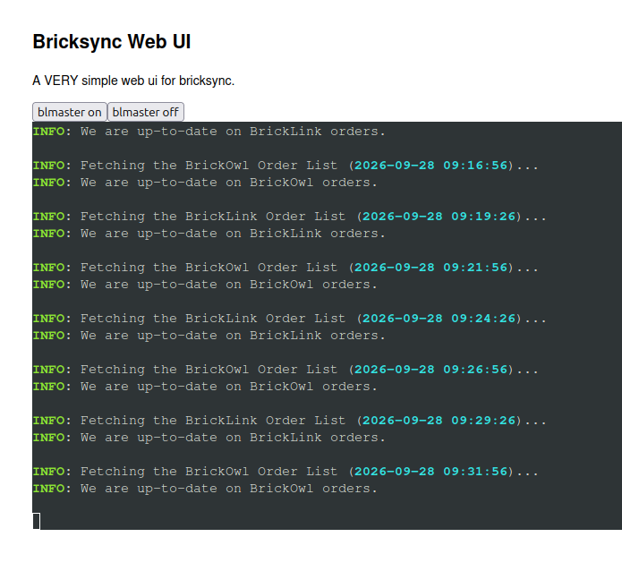

## bricksync-docker

#### CLI version

To build:

`docker build . -f Dockerfile.cli -t bricksync`

To run:

`docker run -it -v ${PWD}/data:/data --rm --name bricksync bricksync`

Or if you don't feel like building:

`docker run -it -v ${PWD}/data:/data --rm --name bricksync  ghcr.io/area128/bricksync-docker:cli-latest`
#### Web UI version

A very basic web page that displays the terminal output of brycksync and has controls for running `blmaster on` & `blmaster off`.

To build Web UI version:

`docker build . -f Dockerfile.ui -t bricksync-ui`

To run:

`docker run -v ${PWD}/data:/data -p 8080:8080 --rm --name bricksync-ui bricksync-ui`

Or if you don't feel like building:

`docker run -it -v ${PWD}/data:/data --rm --name bricksync  ghcr.io/area128/bricksync-docker:ui-latest`

Access the UI at [http://127.0.0.1:8080]()

This is what it looks like. Nothng fancy, just 2 buttons to trigger a resync. You can scroll up and down on the "terminal" but it won't accept any input.

**No security considerations. Run at your own risk.** This is just a proof of concept.

